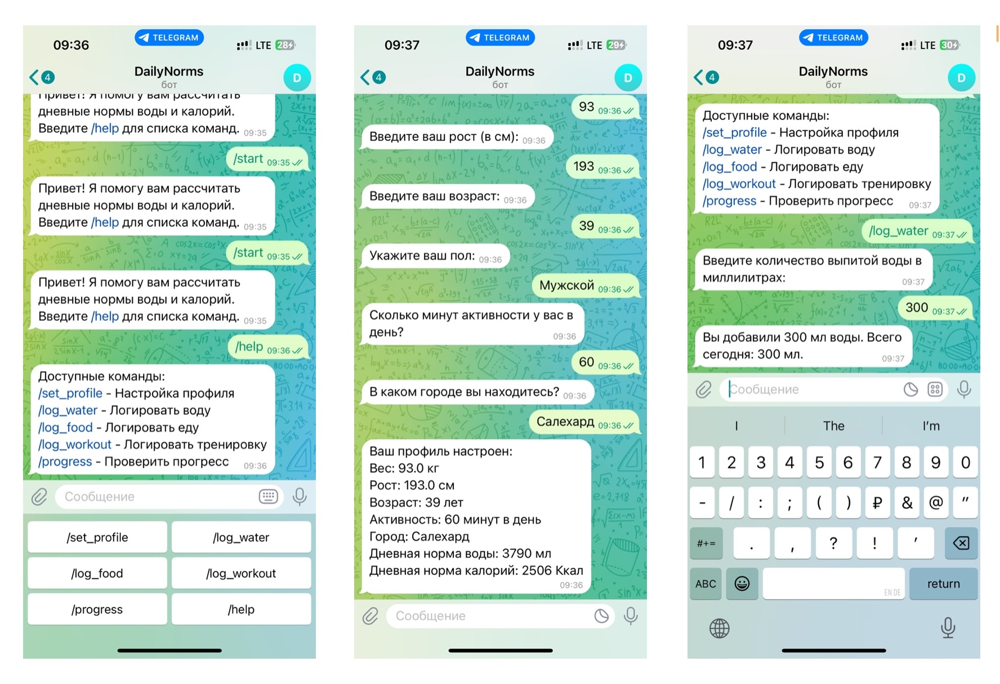
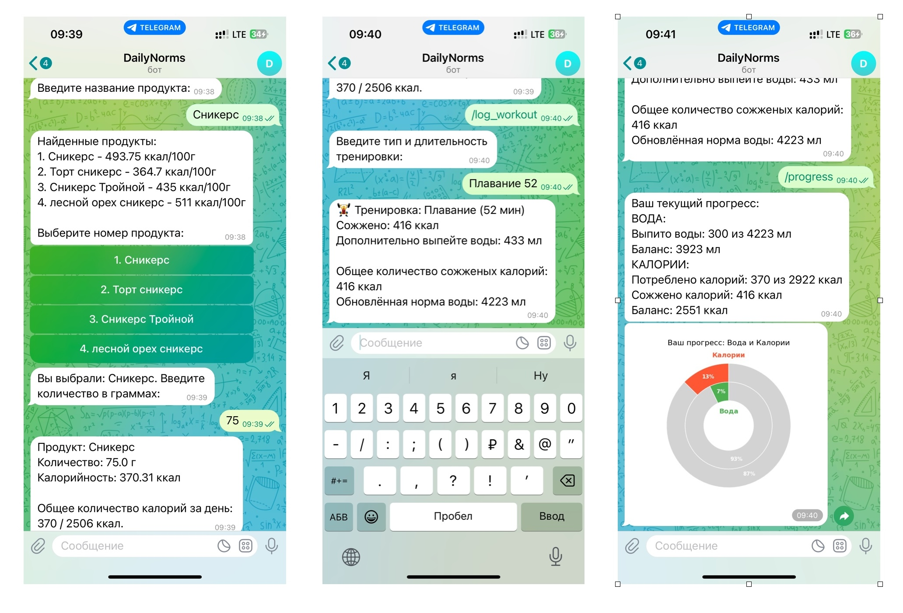
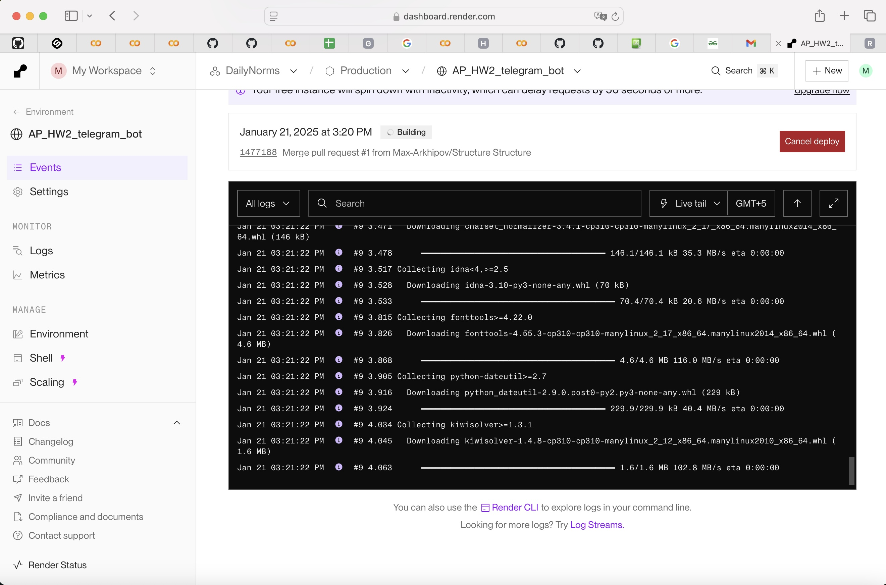
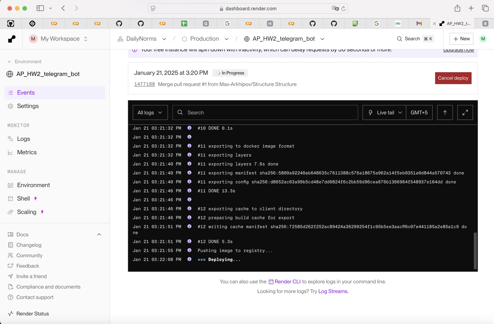
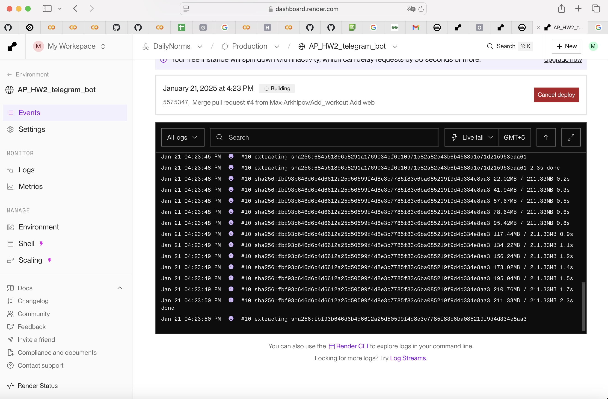
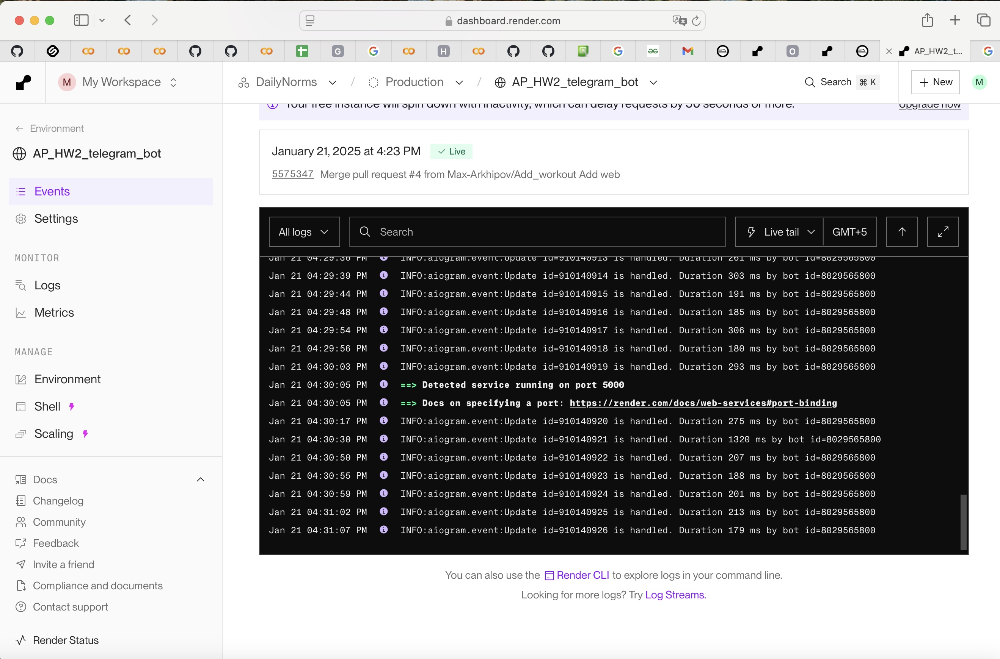

# AP_HW2_telegram_bot
## Домашняя работа №2 по прикладному питону

### 1. Структура проекта
```
project/
├── data/               
│   └──storage.json     # Файл с данными
├── handlers/           
│   ├── __init__.py
│   ├── commands.py     # Окно /help с обработчиками
│   ├── food.py         # Логирование еды
│   ├── profile.py      # Ввод основных сведений о пользователе
│   ├── progress.py     # Вывод информацию по прогрессу
│   ├── water.py        # Логирование воды
│   ├── workout.py      # Логирование тренировок
├── utils/              
│   ├── api.py          # Получение данных из внешних систем
│   ├── calculations.py # Рассчеты
│   └── helpers.py      # Вспомогательные функции
├── .env                # Файл с ключами
├── bot.py              # Основной файл запуска бота
├── config.py           # Файл конфигурации
├── Dockerfile          # Настройка докера
├── requirements.txt    # Зависимости проекта
└── README.md           # Описание проекта
```  
### 2. Формат хранения данных  
``` json
{
    "400485031": {
        "weight": 93.0,
        "height": 193.0,
        "age": 39,
        "gender": "male",
        "activity": 60,
        "city": "Салехард",
        "water_norm": 3790.0,
        "calories_norm": 2505.8,
        "water_logged": 650,
        "calories_logged": 370.3125,
        "burned_calories": 416
    }
}
``` 
### 3. Особенности реализации

    - Доработана функция поиска калорийности продуктов:
        - Ответ ограничен полями "Наименование" и "Калорийность на 100 гр"
        - Сортируем наименования продуктов по наибольшей схожести с запросом
        - Выдаем пользователю топ-5 из получившегося списка
        - Запрашиваем у пользователя количество продукта в граммах

    - Добавлен график прогресса по воде и калориям, выводится для пользователя как картинка в дополнении к текстовому сообщению о прогрессе

### 4. Функционал
    - Меню /help
    - Внесение сведений о пользователе
    - Логирование воды  


    - Логирование еды
    - Логирование тренировок
    - Просмотр прогресса


### 5. Деплой на render.com








